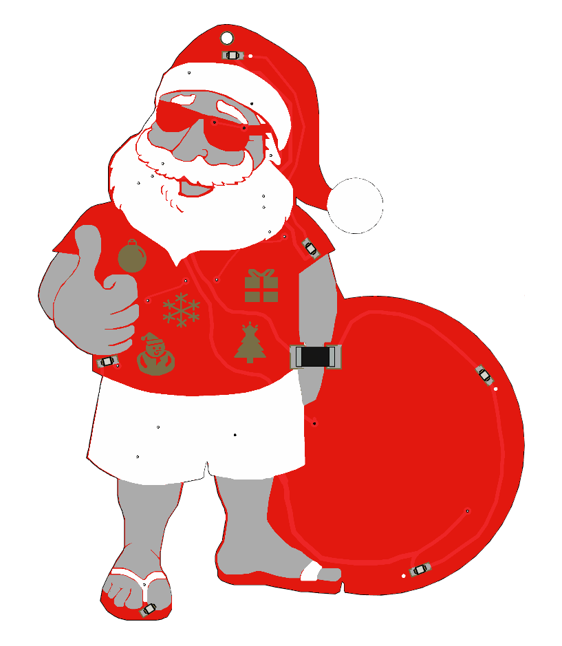
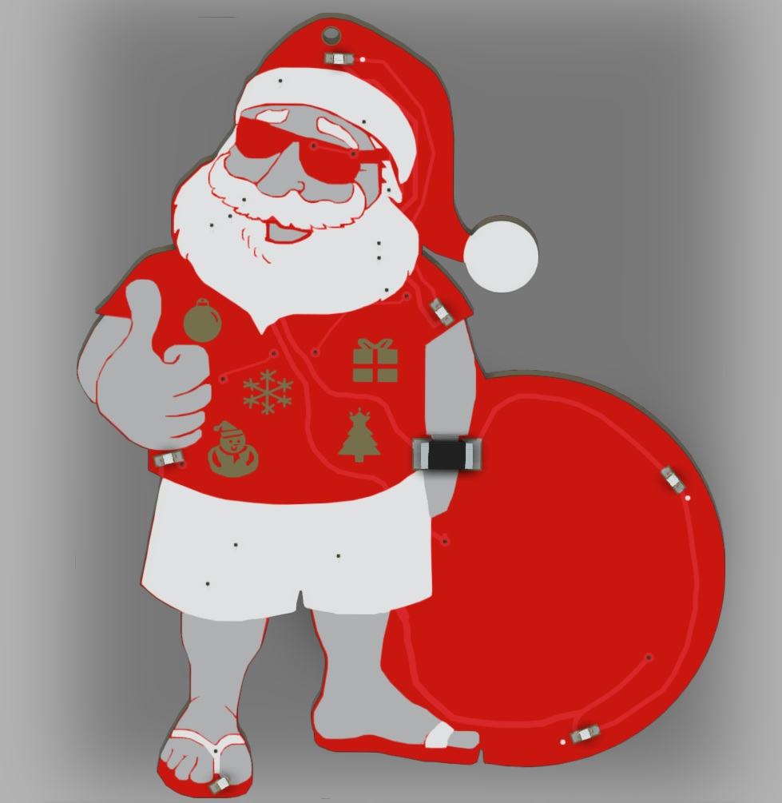
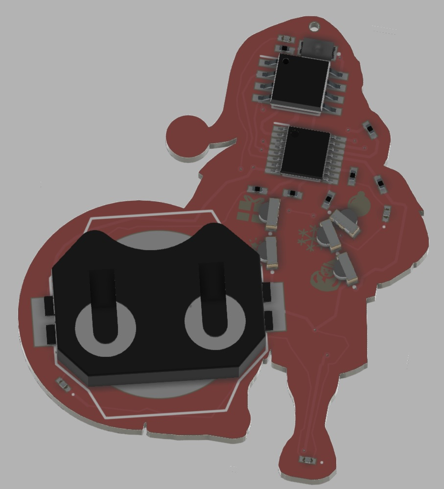
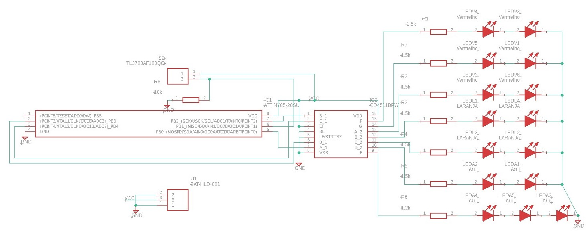

# PCB-Challenge-Santa-Claus
Projeto de PCB desenvolvido para o Julialabs PCB Challange 2021, em que mostra as roupas que o Papai Noel usa em lugares muito quentes.

# Rudolph a rena de nariz vermelho - Cartão de Natal IOT

Olá, eu sou o Rudolph e sei que você me conhece das histórias do Papai Noel, e eu estou aqui para ajudar ele a levar mensagens vindas do mundo todo diretamente para sua árvore de Natal.

Nos dias de hoje, com restrições de viagens (2021/2022), o Papai Noel me pediu alguma idéia genial para fazer as pessoas mais felizes, e olhando para a minha mesa, eu encontrei vários materiais de "Faça Você Mesmo" e com algum esforço, serei capaz de criar meu primeiro dispositivo IOT (Sou chique :D). Deixa eu mostrar o "my precious":

Eu tenho um modulo da espressif chamado ESP32-S2 e um display Oled (SD1309) 128x64 pixels, alguns headers e fiozinhos, além de uma PCB "da hora"(você concorda?) que vai funcionar com um software (firmware) que conectará a internet e recebera mensagens vindas do Twitter e mostrará diretamente na árvore.

Todo esse trabalho duro me deixou cansado e como você sabe, em aguns meses eu precisarei ajudar o velhinho novamente. O Software é um código aberto e você está intimado a ajudar o Velho do Saco também, chega junto e espalhe alegria pelo mundo :)

### Funcionamento

A placa consiste em um attiny85 ligado ao um cd4511 para controlar 14 leds de tres cores:
- 4 leds laranja que vão da iluminação de fundo.
- 5 leds azul  que vai iluminar os símbolos da camisa.
- 4 leds vermelhos para iluminar a frente da PCB

Os leds escolhidos são para aplicações de baixo consumo devido a alimentação ser por uma bateria CR2030, pois os mesmo prometem entregar com 2mA a mesma luminosidade que um led comum consome a 20mA, em que eles forma ligados os pares em serie no cd4511 para aproveitando a tensões deles e utilizar menos saídas. 

Em que foi utilizado attiny85 com cd4511 para criar a alternância de cores, pois projeto é ligar primeiro os leds laranja, depois os vermelhos, depois os azul,depois todos ficarem ligados a mesmo tempo, depois alternando as cores. Podendo usar o botão para para alternar as ordem de iluminação do leds ou acordar o attiny85. 

## Software

Esse é um trabalho em desenvolvimento, será feito usando o Framework Arduino, e se for possivel programarei no Platform.IO (Extensão do VS Code). A idéia é ter uma configuração de Wifi que irá guiar o usuário pela configuração e mostrará o caminho para a configuração da conta no Twitter também. E depois disso, é só correr para o abraço, ou melhor, ver as mensagens chegaram na tela, diretamente do mundo inteiro!

Veja a lista de componentes, images e links no final desse arquivo.

## Imagens com os componetes 

## Esquemático

## Lista de Compras

| Qtde| Item              | Descrição       |
| --- | ---               | ---             |
| 01  | [ESP32-S2-WROOM](https://br.mouser.com/ProductDetail/356-ESP32S2WRM3200PH)    | MCU ESP32-S2    |
| 02  | [667-EVQ-P0N02B](https://br.mouser.com/ProductDetail/667-EVQ-P0N02B)    | Push Button     |
| 02  | [WSL080500000ZEA9](https://br.mouser.com/ProductDetail/71-WSL080500000ZEA9)  | Resistor 0Ohms  |
| 04  | [TMCP1A106MTRF](https://br.mouser.com/ProductDetail/74-TMCP1A106MTRF)     | Capacitor 10uF  |
| 03  | [885382207007](https://br.mouser.com/ProductDetail/710-885382207007)      | Capacitor 100nF |
| 02  | [C0805C200J3GACTU](https://br.mouser.com/ProductDetail/80-C0805C200J3G)  | Capacitor 20pF  |
| 01  | [C0805C105K4RAC7210](https://br.mouser.com/ProductDetail/80-C0805C105K4R7210)| Capacitor 1uF   |
| 01  | [1N5819W-T](https://br.mouser.com/ProductDetail/583-1N5819W-T)         | Diode           |
| 03  | [CPDUC5V0R-HF](https://br.mouser.com/ProductDetail/750-CPDUC5V0R-HF)      | Diode           |
| 01  | [APT2012CGCK](https://br.mouser.com/ProductDetail/604-APT2012CGCK)       | LED             |
| 01  | [4684](https://br.mouser.com/ProductDetail/485-4684)              | Neopixel RGB LED|
| 01  | [NCP1117LPST33T3G](https://br.mouser.com/ProductDetail/863-NCP1117LPST33T3G)  | LDO             |
| 01  | [20021121-00010C8LF](https://br.mouser.com/ProductDetail/649-200211210010C8LF)| Headers         |
| 01  | [UJ2-MIBH-G-SMT-TR](https://br.mouser.com/ProductDetail/490-UJ2-MIBH-G-SMTTR) | USB Socket      |
| 01  | [OLED Display](https://s.click.aliexpress.com/e/_Aa7ykQ)      | OLED Display    |
